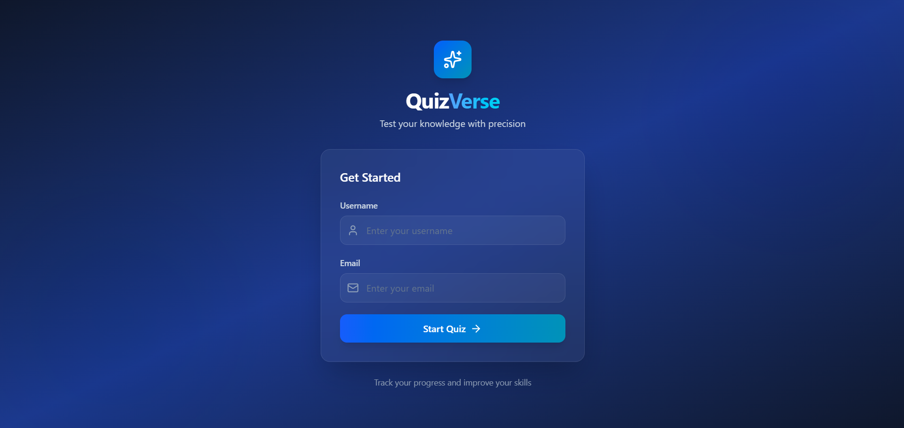
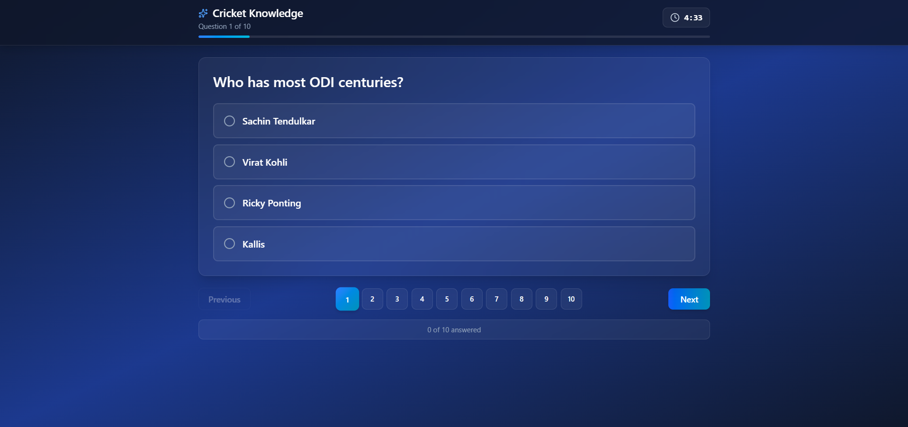
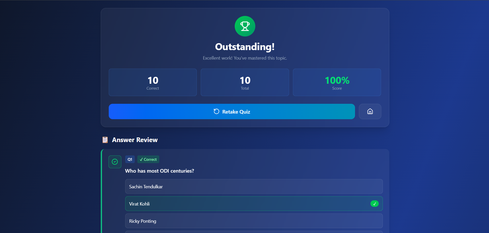

# 🧠 QuizVerse – Full Stack Quiz Application

A modern, full-stack quiz platform built using **React (Frontend)** and **Node.js (Backend)**, featuring real-time scoring, multiple quiz categories, and a sleek **glassmorphism UI**. This project demonstrates clean architecture, modular backend design, and responsive frontend implementation for an end-to-end quiz experience.

---
## Screenshots




---

---

## 📖 Project Overview

**QuizVerse** allows users to:
- Register and take quizzes across multiple categories (Tech, Cricket, Football)
- Receive instant feedback and detailed score breakdowns
- Review answers with correct/incorrect indicators
- Track quiz attempts in a persistent SQLite database

### 🧩 Tech Stack
| Layer | Technology |
|-------|-------------|
| **Frontend** | React 19, React Router DOM, Tailwind CSS, Lucide Icons |
| **Backend** | Node.js, Express.js |
| **Database** | SQLite3 |
| **State Management** | Context API + useReducer |

---

## 📂 Repository Structure
```
quiz-application/
├── backend/                    # Node.js Backend
│   ├── src/
│   │   ├── config/             # Database connection
│   │   ├── controllers/        # Business logic
│   │   ├── models/             # Data access layer
│   │   └── routes/             # API endpoints
│   ├── constants/data.js       # Quiz seed data
│   ├── db/quiz.db              # SQLite database
│   ├── seed.js                 # Database seeding script
│   ├── index.js                # Server entry point
│   └── package.json
│
├── frontend/                   # React Frontend
│   ├── src/
│   │   ├── components/         # Reusable components
│   │   ├── contexts/           # Quiz context and reducer
│   │   ├── hooks/              # Custom hooks
│   │   ├── pages/              # Page components
│   │   ├── services/           # API service layer
│   │   └── App.jsx             # Main entry component
│   ├── index.html
│   ├── vite.config.js
│   └── package.json
│
└── README.md                   # This file
```

---

## ⚙️ Local Setup Instructions

### 🧱 Prerequisites
- Node.js **v16+**
- npm or yarn
- Git

### 1️⃣ Clone Repository
```bash
git clone <your-repo-url>
cd quiz-application
```

### 2️⃣ Backend Setup
```bash
# Navigate to backend directory
cd backend

# Install dependencies
npm install

# Optional: install manually if missing
npm install express cors sqlite3 sqlite

# Seed the database
node seed.js

# Start the backend server
node index.js
```
✅ Backend runs on **http://localhost:3000**

Expected output:
```
Database connected successfully
✅ All quizzes and questions inserted successfully!
Server is running on port 3000
```

### 3️⃣ Frontend Setup
```bash
# Navigate to frontend directory
cd ../frontend

# Install dependencies
npm install

# Optional: install manually if missing
npm install react react-dom react-router-dom lucide-react

# Setup Tailwind CSS
npm install -D tailwindcss postcss autoprefixer
npx tailwindcss init -p

# Start development server
npm run dev
```
🌐 Frontend runs on **http://localhost:5173**

### 4️⃣ Access the App
Visit **http://localhost:5173** in your browser.

---

## 🧪 Running Test Cases

### Manual Testing Scenarios
| Test | Scenario | Expected Result |
|------|-----------|----------------|
| 1️⃣ | User Registration | Redirects to quiz page after user submits details |
| 2️⃣ | Quiz Flow | Navigation between questions works, answers persist |
| 3️⃣ | Timer Auto-Submit | Quiz auto-submits when timer reaches 0 |
| 4️⃣ | Manual Submit | Shows score summary and answer breakdown |
| 5️⃣ | Score Calculation | Matches number of correct answers |
| 6️⃣ | Answer Review | Displays user’s answers vs correct answers |

### API Testing (Postman / Thunder Client)
#### Create User
```
POST http://localhost:3000/api/v1/users/create
{
  "name": "Test User",
  "email": "test@example.com"
}
```
#### Get Random Quiz
```
GET http://localhost:3000/api/v1/quiz/random
```
#### Submit Quiz
```
POST http://localhost:3000/api/v1/quiz-attempts/random
{
  "quizId": 1,
  "userId": 1,
  "answers": { "1": "HTML", "2": "JavaScript" }
}
```

---

## 💡 Design Choices & Assumptions

### 🧱 Architecture Decisions
1. **Monorepo Structure** – Single repository with `/frontend` and `/backend` for ease of deployment.
2. **SQLite Database** – Lightweight, easy setup, ideal for local development.
3. **Context API + useReducer** – Centralized state without external dependencies like Redux.
4. **RESTful APIs** – Clean, JSON-based communication between frontend and backend.

### 🔑 Key Assumptions
- Auto-submit: Enabled after timeout
- Scoring: +1 per correct answer, no negative marking
- User session: Stored in React Context (resets on refresh)
- No authentication (for simplicity)

---

## 🔒 Security & Scalability

### ⚠️ Current Implementation
- No JWT authentication
- CORS enabled for all origins
- No rate limiting or input sanitization

### 🚀 Recommended Improvements
- Add JWT-based authentication
- Enable rate limiting
- Sanitize inputs using middleware
- Move secrets to `.env`
- Deploy with HTTPS

### 📈 Scalability Considerations
- Switch to **PostgreSQL** or **MongoDB** for production
- Add Redis for caching or session management
- Implement Docker for containerization

---

## 🌍 Environment Variables

**Backend `.env`**
```
PORT=3000
NODE_ENV=development
```

**Frontend `.env`**
```
VITE_API_URL=http://localhost:3000/api/v1
```

---

## 🔗 API Reference
| Method | Endpoint | Description |
|---------|-----------|-------------|
| POST | /api/v1/users/create | Create or fetch user |
| GET | /api/v1/users/:id | Get user by ID |
| GET | /api/v1/quiz/random | Fetch random quiz |
| POST | /api/v1/quiz-attempts/random | Submit quiz answers |
| GET | /api/v1/quiz-attempts/:id | Get quiz attempt details |

**Response Format:**
```json
{
  "success": true,
  "message": "Operation successful",
  "data": { ... }
}
```

---

## 🚧 Known Issues
- User session resets on refresh
- No leaderboard or quiz history view
- Questions not randomized
- No image support in questions

---

## 🔮 Future Enhancements
- User authentication with JWT
- Quiz category selection
- Leaderboards & ranking
- Question randomization
- Admin panel for quiz management
- Explanations for answers
- Multi-language support
- Timed practice mode
- AI powered question generation
---

## 🤝 Contributing
1. Fork the repository
2. Create a new branch (`git checkout -b feature/AmazingFeature`)
3. Commit changes (`git commit -m 'Add AmazingFeature'`)
4. Push to branch (`git push origin feature/AmazingFeature`)
5. Open a Pull Request

---


>  Built by Shivansh Saxena – Clean code, modern design, and a love for learning!

